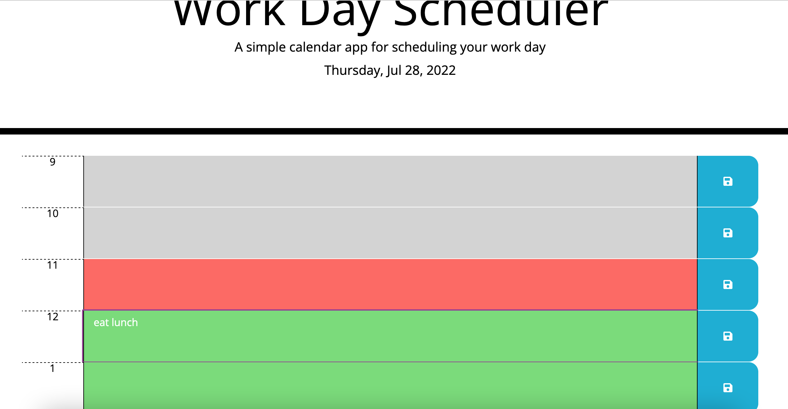

# schedulerER

## Description
This mini app shows a simple workday scheduler for the current day. It has timeblocks from 9 to 5 and allows you to edit only the present (in red) and future (green) timeblocks. The save button for each block then saves that text data to local storage.
It allowed me to experiment with Bootstrap and JQuery dynamic rendering.

## Deployment
Access the app at https://emilyerose.github.io/schedulerER/ 

## Usage
You can type into the blocks representing hours that you are currently in or that have yet to happen. blocks from earlier in the day cannot be altered. If you hit a save button for a corresponding hour, the contents of that block will be saved to local storage with the key 'hour{relevanthour}'
The basic webpage looks like this: 

## Credits
None relevant, except that I started with lots of starter code and Ben helped out with some debugging

## license
none relevant